
<h1 align="center">基于web的音乐网站</h1>

## 简介
基于Spring Boot的音乐网站，角色包括管理员和用户，提供用户注册、登录、个人中心、音乐播放、下载管理、歌曲信息浏览与分类管理、评论互动、推荐功能以及后台系统配置等多样化功能。    --计算机毕业设计源码；毕设源码；java毕业设计源码

## 联系方式

<h3 align="center">获取完整代码与数据库文件 + 微信：deepguan QQ: 86050149 QQ群: 783742310</h3>

<h3 align="center">可帮忙远程部署 包运行成功！提供远程部署、修改代码、设计文档指导、代码讲解等服务！</h3>

## 功能介绍（完整见运行截图）
管理员： 基本功能包括登录、注册、和退出。网站首页由导航栏组成，提供对主要功能的快速访问。管理后台允许执行用户管理、歌曲分类管理、歌曲信息管理和系统配置。管理员可查看并回复用户评论、管理轮播图以及上传管理音乐文件。歌曲信息评论管理功能帮助维护评论区的秩序。

普通用户： 用户可以进行登录、注册、和退出操作。用户界面配备了导航栏以便于浏览和访问，如首页、个人中心、和音乐库。个人中心允许查看及编辑个人信息，包括用户名、密码和其它个人资料。用户还可通过网站搜索功能查找并播放音乐，将其添加到播放列表或下载到本地设备。注册新用户通过填写简单的表单资料进行。

## 运行截图
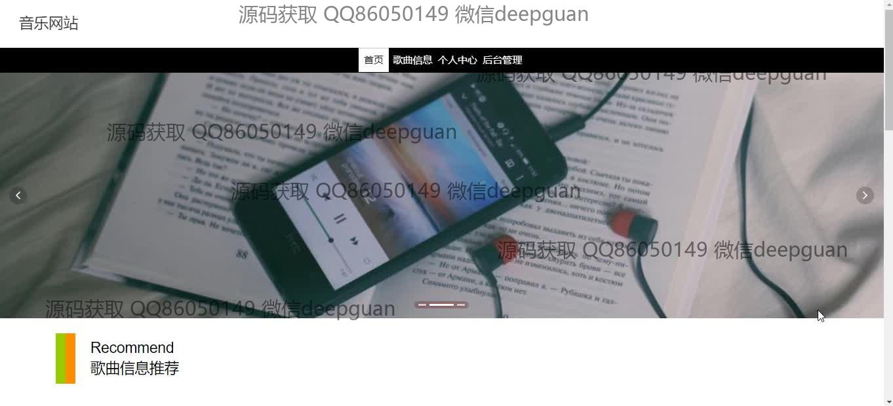

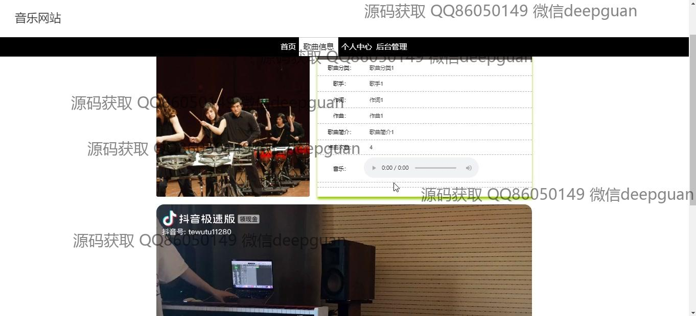
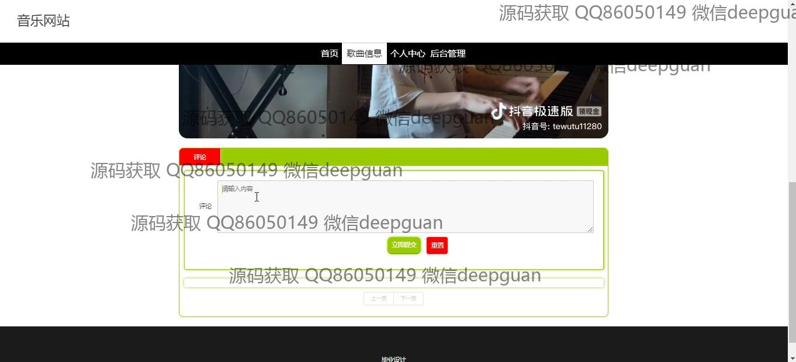
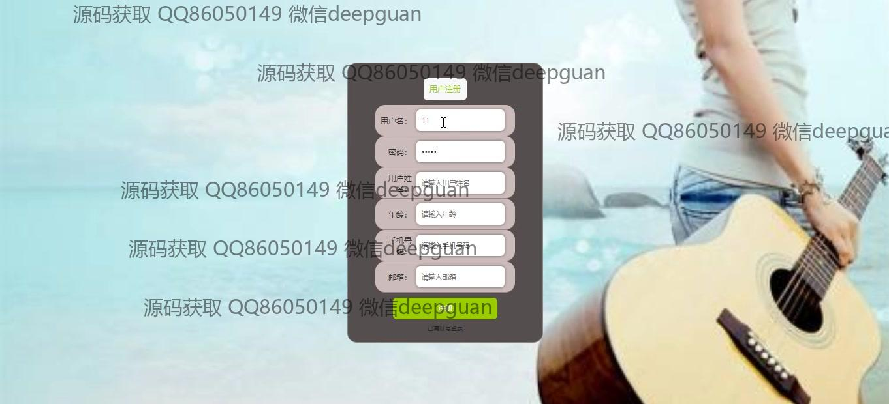
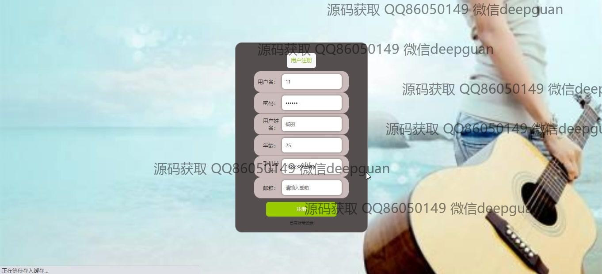
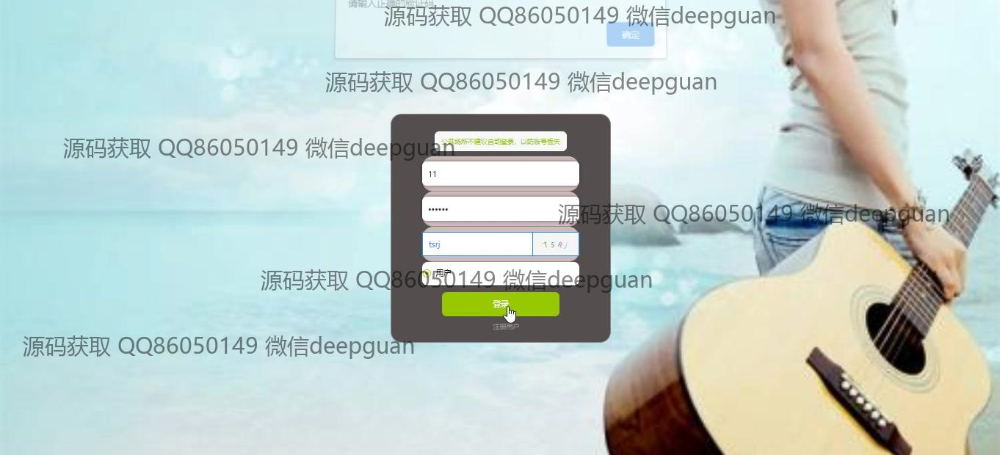
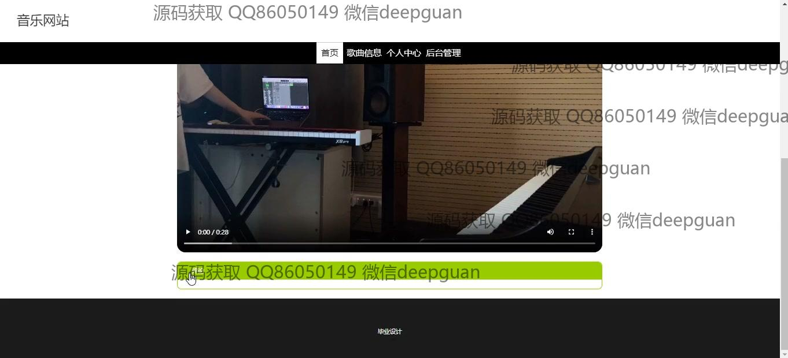
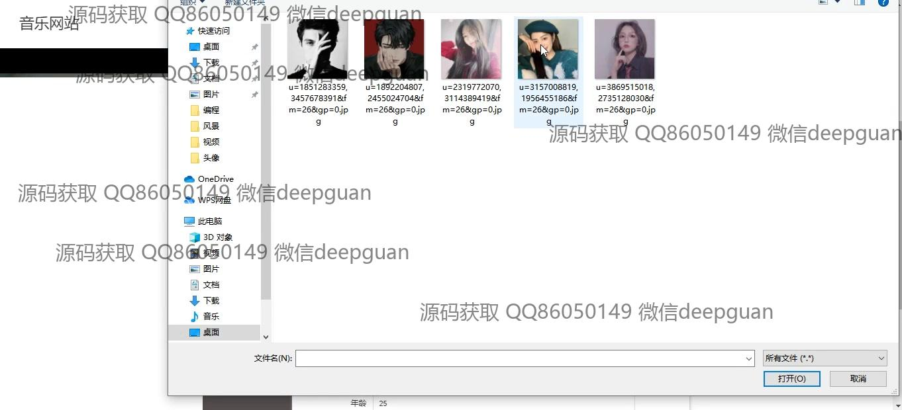
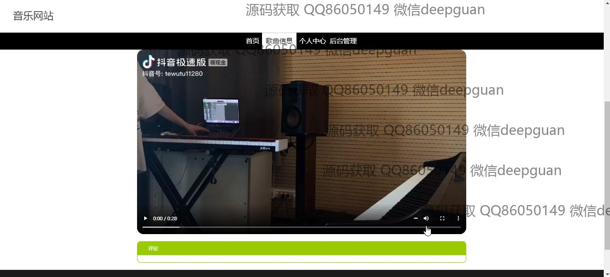
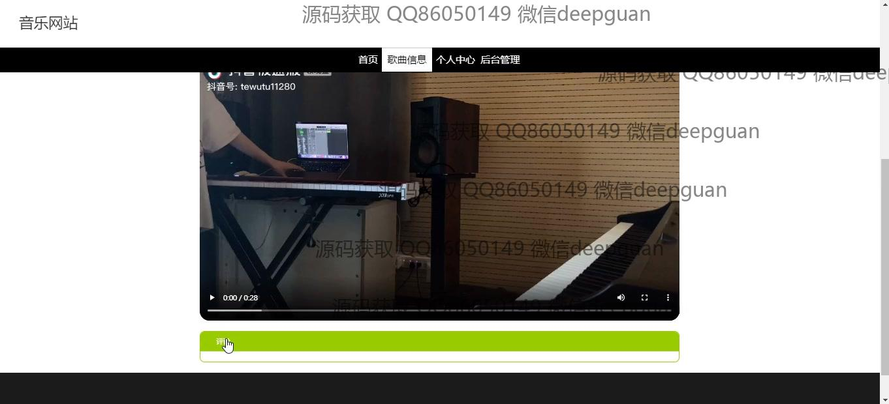
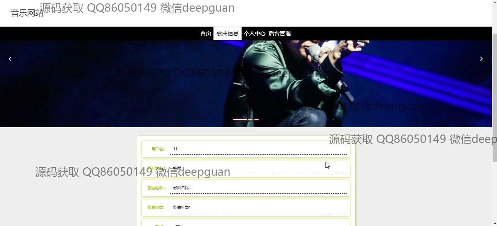
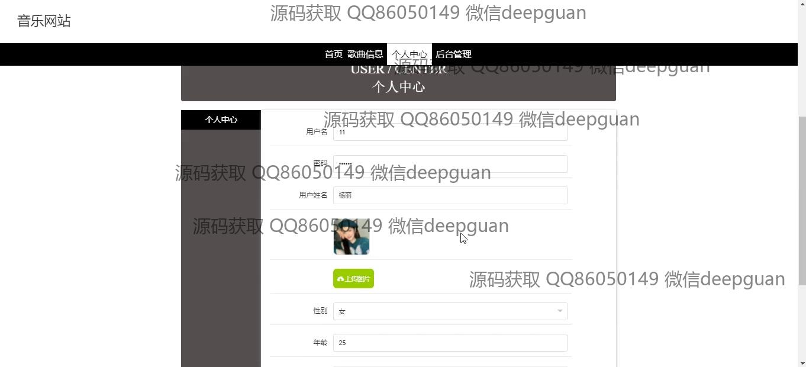
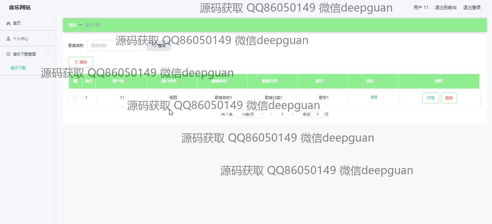
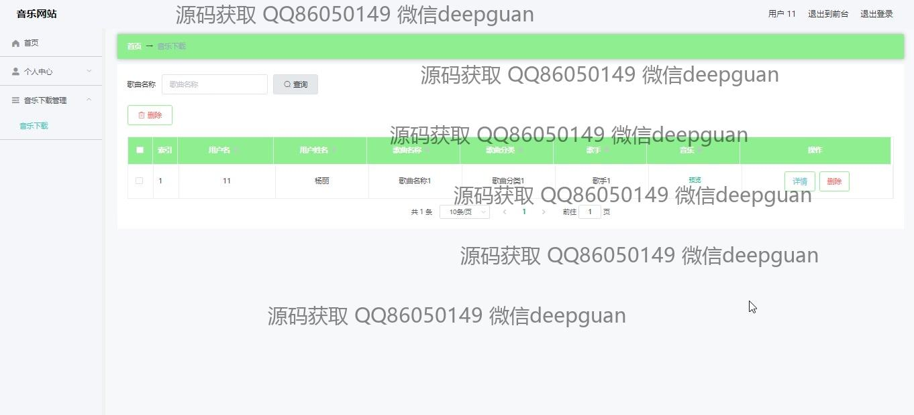
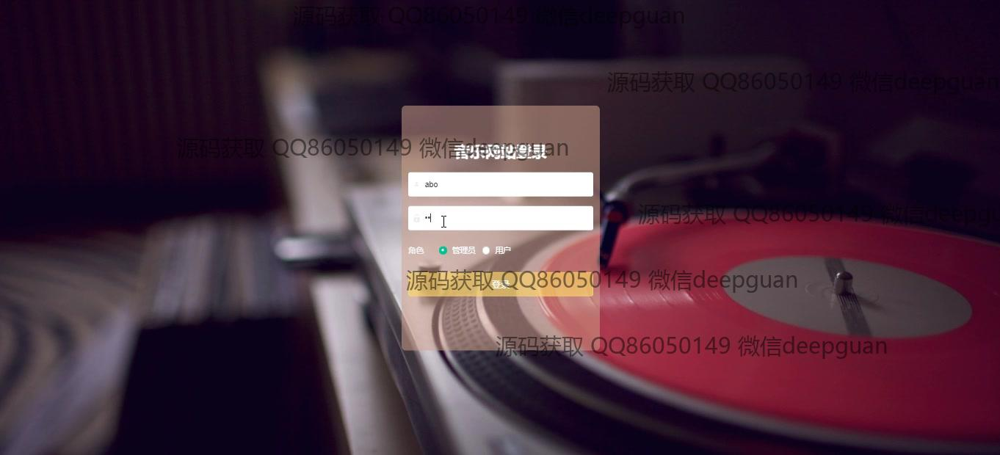
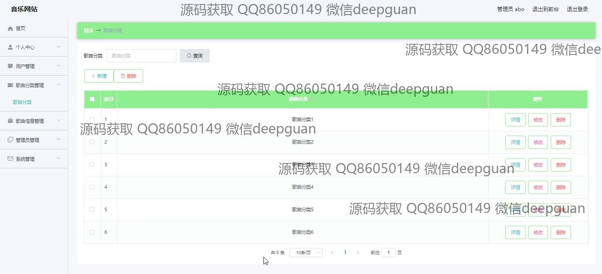
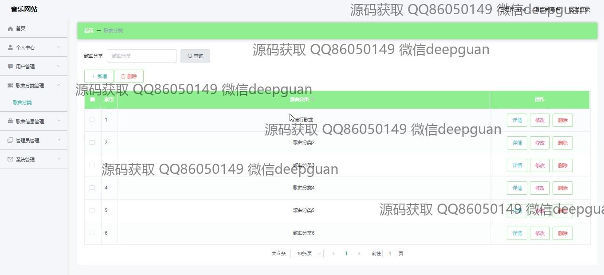
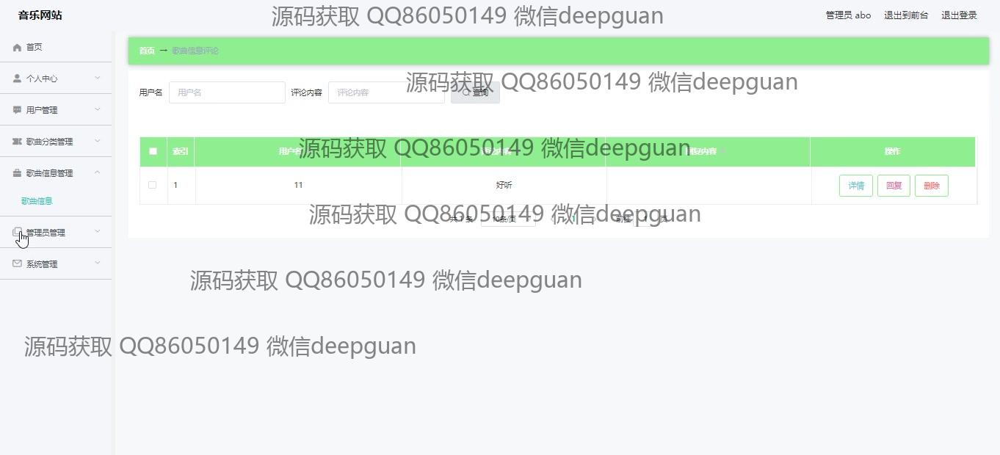
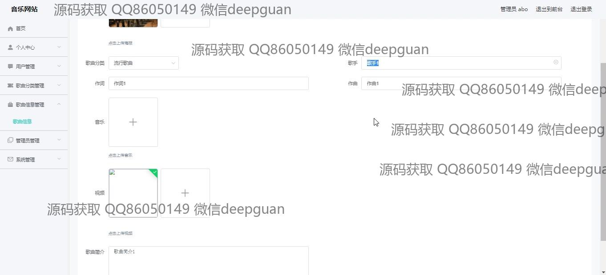
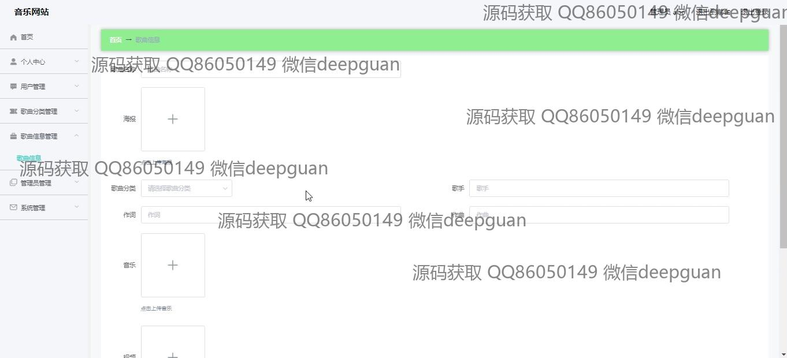
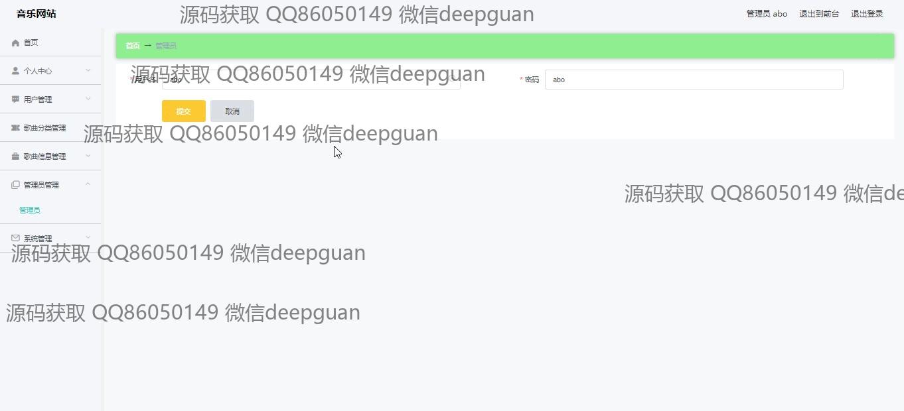
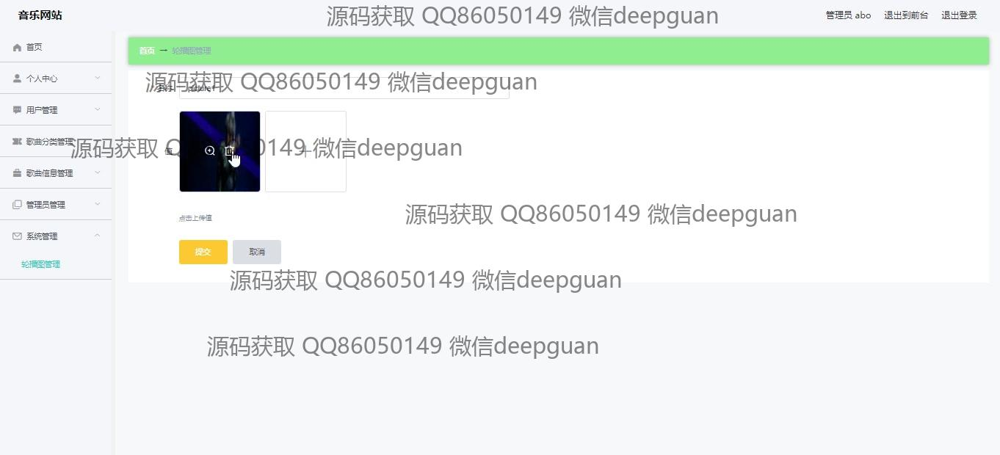

本代码来源于网络,仅供学习参考使用!

